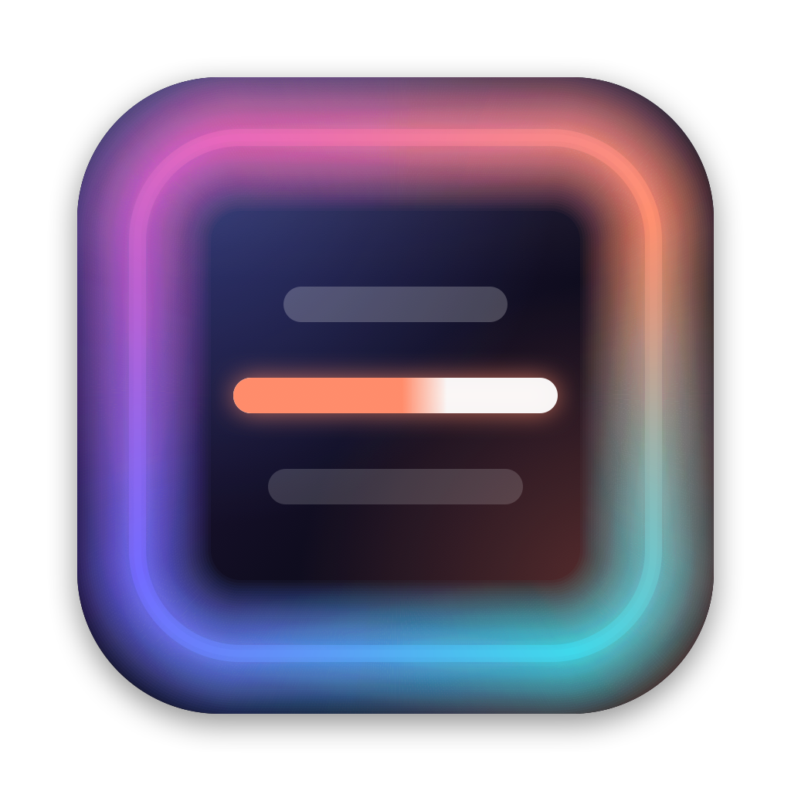
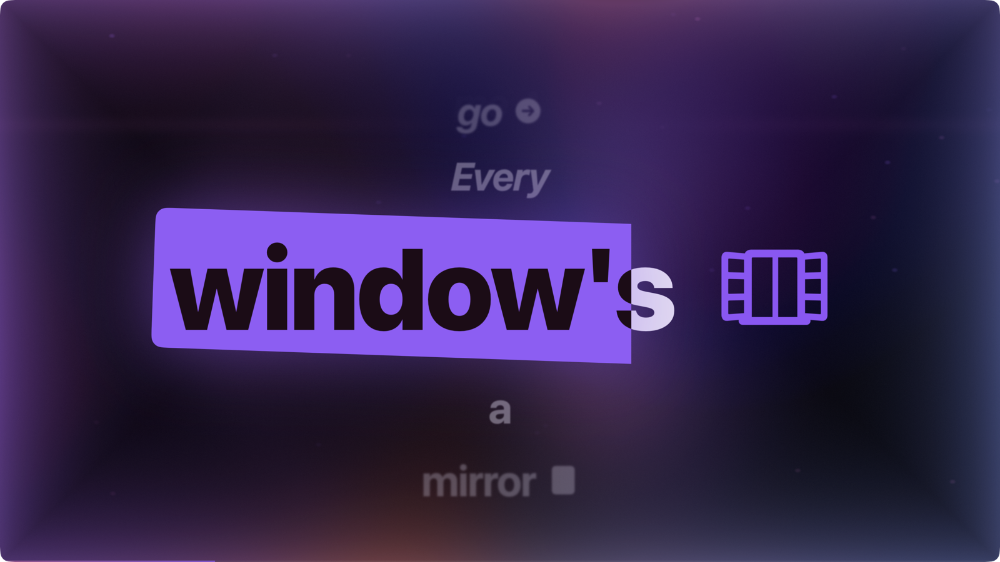
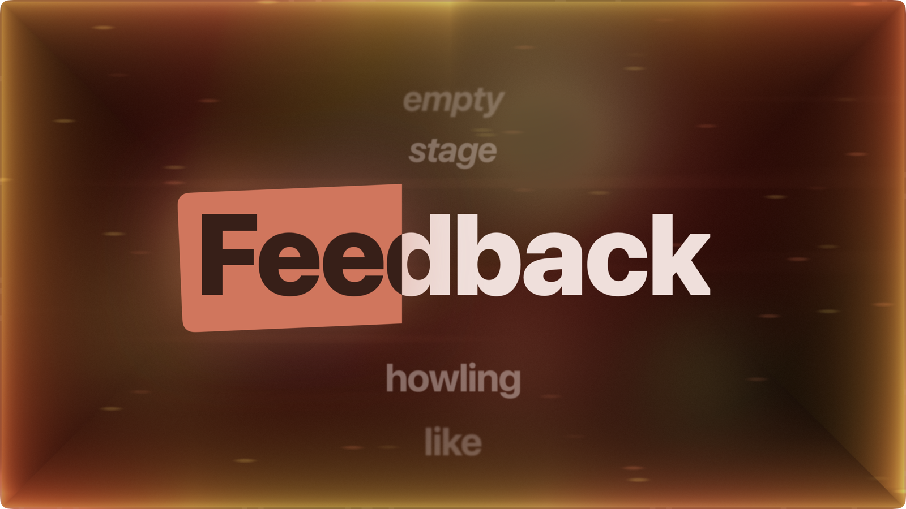
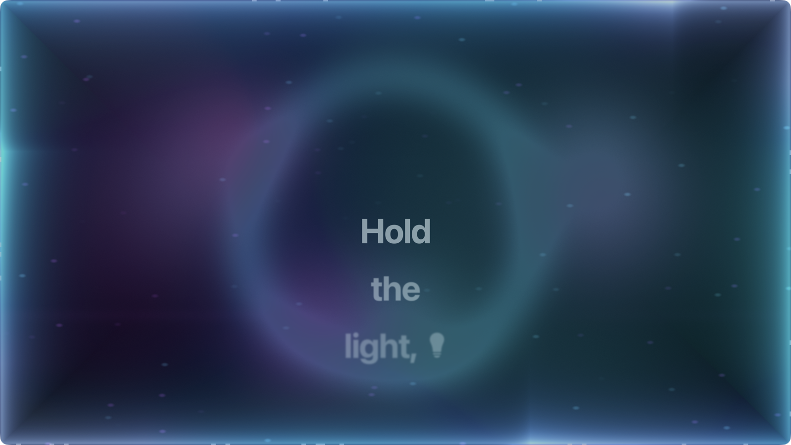
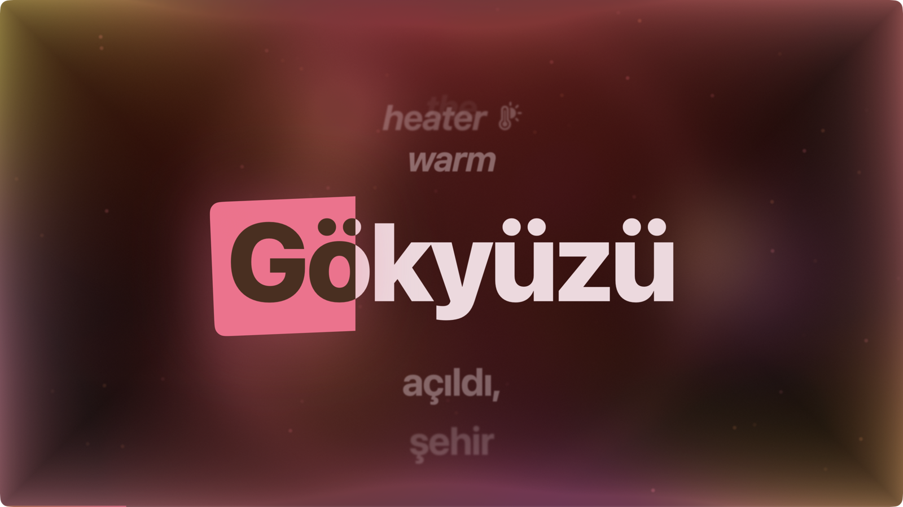
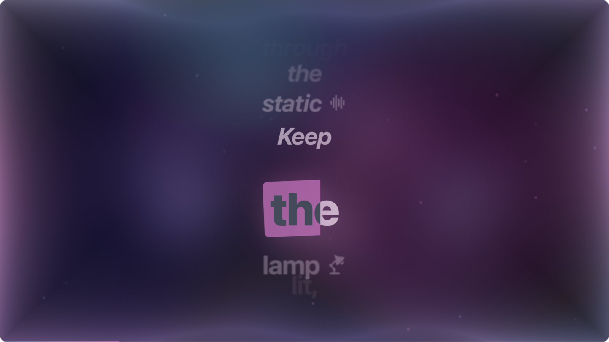
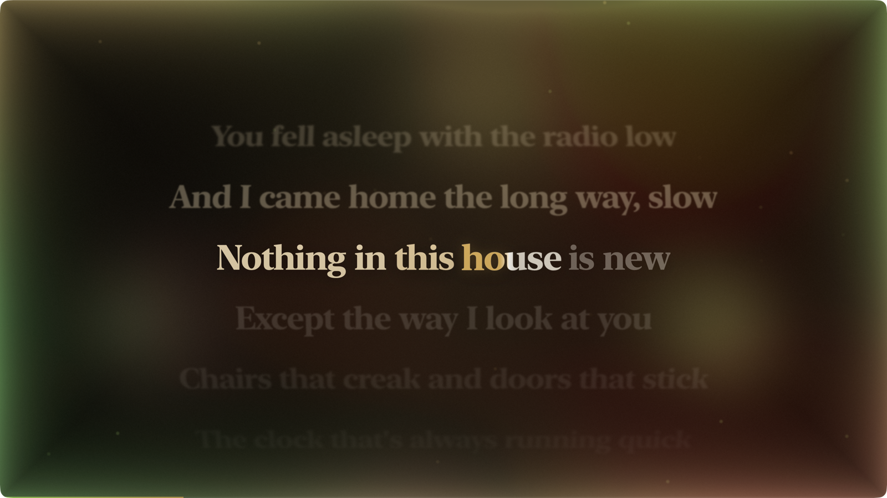
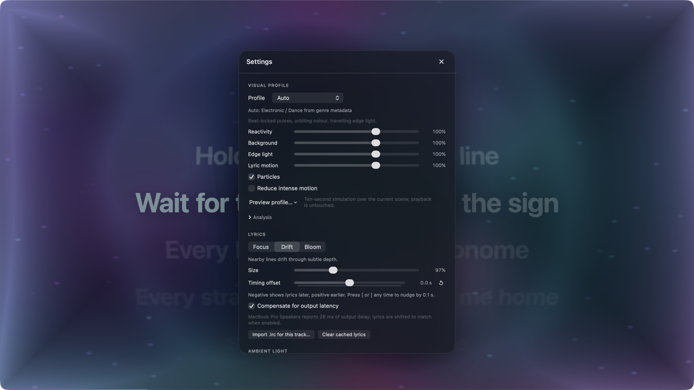

<div align="center">



# Vela

**Lyrics and light for whatever is playing.**

Word-synced lyrics in the middle of the screen, colours pulled from the album art, and an
ambient glow around the edges of the display that moves with the music.
Works with Spotify and Apple Music on macOS. No accounts, no keys.



</div>

---

## What it does

Vela reads the Spotify or Apple Music app running on your own machine. Track, artist,
album, artwork, position and the previous / play-pause / next controls all work through the
players' own scripting interfaces, so nothing needs to be signed in to.

Lyrics come from the community LRCLIB database, from `.lrc` files you import, or from the
songs bundled with Demo Mode. When a file carries word timing it is used as is; when only
line timing exists, Vela estimates the words from their length and punctuation and says so
in a small badge. Plain lyrics fall back to a slow, unsynced scroll. The word being sung fills
with the album's accent colour and the previous and next lines stay visible, quieter, above
and below.

The light around the display is drawn on the GPU from the album palette. Bass expands the
backdrop and thickens the glow, mids move the gradient, highs add fine detail, and beats
fire short, smoothed impulses. It never flashes and never strobes. When nothing is playing,
it settles into a slow breath.

## Six personalities

Different music gets a different visual character. Vela listens and picks a profile on its
own, or you lock one in Settings. Every profile keeps the album artwork as its colour source
and bends it: contrast, warmth, bloom, motion, particles and the way the lyrics move all
change with it.

<table>
<tr>
<td align="center" width="50%"><br><b>Rap / Trap</b><br><sub>Bass-driven punches, dark backdrop,<br>focused bright accents</sub></td>
<td align="center" width="50%"><br><b>Rock / Metal</b><br><sub>Warm, high contrast,<br>streaks on the drum hits</sub></td>
</tr>
<tr>
<td align="center"><br><b>Electronic / Dance</b><br><sub>Beat-locked pulses, orbiting colour,<br>light that travels round the edge</sub></td>
<td align="center"><br><b>Pop</b><br><sub>Glossy blooms,<br>balanced motion</sub></td>
</tr>
<tr>
<td align="center"><br><b>R&amp;B / Ambient</b><br><sub>Liquid gradients, slow waves,<br>lyrics that float</sub></td>
<td align="center"><br><b>Acoustic / Classical</b><br><sub>Soft luminance, minimal light,<br>motion that follows phrasing</sub></td>
</tr>
</table>

Auto detection is hybrid. Apple Music exposes a genre, and that decides immediately.
Spotify's scripting interface does not, so Vela measures the audio instead: tempo and how
confident it is in it, bass against mids, brightness, how much the spectrum changes, how many
onsets there are and how hard they hit, dynamic range, loudness and rhythmic regularity. It
waits a few seconds, commits once it is confident, keeps that profile for the rest of the
track, and only reconsiders if it was unsure to begin with or the music changes for good.
Profiles crossfade rather than switch. Pop is the neutral fallback.

## Settings

Everything lives in one translucent panel over the scene: the visual profile, four sliders for
how strongly the scene reacts (overall, background, edge light, lyric motion), particles, a
gentler-motion toggle, a ten-second preview of any profile without touching playback, and an
Analysis disclosure that shows what the detector is currently hearing.

<div align="center">

</div>

## Install

Download the latest `.dmg` from [Releases](https://github.com/sayginsaman/Vela/releases),
open it, and drag Vela to your Applications folder. Releases are signed with a Developer ID
and notarized by Apple, so the app opens like any other Mac app.

On first run macOS asks whether Vela may control Spotify or Music. That is the standard
Automation prompt and it is how the app reads what is playing. Vela also asks for Screen &
System Audio Recording so the light can follow the sound; the microphone is never used and
the audio is analysed on your Mac and never stored. Decline either and nothing breaks: the
player state still shows and the light breathes on its own.

Requires macOS 14 or later on Apple Silicon.

## Using it

**Full screen** is the whole point. Press ⌘F, or use the button in the controls bar. Escape
leaves it again (after closing Settings, if that is open).

**Controls** appear when you move the pointer or press Space, and fade after about three
seconds while music plays. They carry the artwork, title and artist, a scrubbable progress
bar, previous / play-pause / next, full screen and Settings.

**Keyboard**

| | |
|---|---|
| Space | Show controls, or play / pause while they are visible |
| ← / → | Seek five seconds |
| ⌘← / ⌘→ | Previous / next track |
| ⌘F | Toggle full screen |
| ⌘, | Settings |
| ⌘⇧D | Demo Mode |
| ⌘⇧N | Next demo fixture |
| ⌘⇧P | Cycle the visual profile |
| Esc | Close Settings, then leave full screen |

**Lyric styles.** *Focus* keeps the current line centred with precise word highlighting and
is the default. *Drift* lets the neighbouring lines recede through a little depth. *Bloom*
makes each word swell and glow as it is sung. All three respect the visual profile's motion.

**Timing.** If lyrics run early or late, the timing offset slider shifts them by up to five
seconds either way. Imported `.lrc` files always win over anything fetched.

**Accessibility.** Reduce Motion removes camera movement, punches and rapid scale changes
and swaps spatial transitions for crossfades; colour and brightness reactions stay. Increase
Contrast and Reduce Transparency are honoured, every control has a VoiceOver label, and the
whole app works from the keyboard. Nothing ever flashes.

## Demo Mode

⌘⇧D, or "Try Demo" at the end of the welcome flow, needs no player, permissions or network.
Vela plays an eight-song catalogue of original material with procedural artwork and a real-time
timeline you can seek, skip and pause. Six of the songs are audio fixtures, one per profile:
Concrete Halo, Wirecutter, Signal Bloom, Paper Lanterns, Low Tide Signal and Kitchen Light.
Each generates its own kick, snare and hat patterns, section dynamics and spectral character,
and that signal runs through exactly the analysis captured audio does, so Auto detection, the
diagnostics and the reactive background behave the same. The other two songs show the
unsynced and instrumental states. Settings has a track picker; ⌘⇧N cycles the fixtures.

## Development

```bash
open Vela.xcodeproj
```

```bash
xcodebuild -project Vela.xcodeproj -scheme Vela -configuration Debug build
```

```bash
xcodebuild -project Vela.xcodeproj -scheme Vela -configuration Debug test
```

Xcode 16 or later; the project uses synchronized folder groups. The Metal shaders are compiled
at runtime from source, so the Metal toolchain does not need to be installed. Local builds sign
ad hoc, which means macOS asks for the privacy permissions again after every rebuild; set your
team in Signing & Capabilities to avoid that. Release builds come from `scripts/release.sh`,
which signs with a Developer ID Application certificate, notarizes, staples and packages the
disk image (the one-time setup is described at the top of the script).

### Architecture

Everything lives in one app target, grouped by responsibility:

- `App/AppModel.swift` — `@MainActor @Observable` application state. Consumes player events,
  drives lyric/artwork loading with cancellation, owns overlay/keyboard/fullscreen state.
- `MusicSources/` — `MusicSource` protocol, `SpotifySource` and `AppleMusicSource` (AppleScript on
  a private serial queue, never the main thread), `DemoMusicSource` (actor with a real-time
  timeline), and `MusicSourceCoordinator` (an actor that detects the active player, polls at an
  adaptive rate, listens to the players' distributed notifications, and forwards commands).
- `Lyrics/` — `LyricsProvider` protocol; `LRCParser` (standard and enhanced word-level LRC),
  `WordTimingEstimator`, `LyricTimeline` (cursor-based active-word lookup with binary-search
  seeking), `LRCLIBProvider`, `LyricsCache` (disk, keyed by a normalised hash of artist/title/
  album/duration), `LocalLyricsStore` (imported `.lrc` files) and `LyricsService` (the resolver).
- `Palette/` — `PaletteExtractor` (histogram over a 32×32 sample), `PaletteCorrector` (contrast,
  similarity and muddiness rules), `ArtworkProcessor` (soft and sharp pre-blurred backdrops).
- `Audio/` — `SystemAudioCapture` (ScreenCaptureKit), `SpectrumAnalyzer` (vDSP FFT → raw band
  energies, RMS, spectral centroid and flux per block), `FeatureExtractor` (normalisation,
  per-band transients, onset detection, autocorrelation tempo estimate with beat-phase tracking,
  onset density, transient strength, dynamic range, loudness, regularity), `ProfileFixtures`
  (deterministic per-profile "music" for Demo Mode and previews, run through the same
  extractor), and `FeatureStore` (lock-protected mailbox to the render thread).
- `Visual/` — `VisualProfile` / `VisualProfilePreset` (declarative per-profile parameters with
  interpolation, Reduce Motion and intensity transforms), `GenreNormalizer`,
  `ProfileClassifier` (weighted range-membership scoring), `ProfileDetector` (windowing,
  locking, hysteresis), `PaletteStyler` (profile colour treatment with readability re-enforced)
  and `VisualDirector`, which fuses profile, features, palette, accessibility and user
  intensities into one attack/release-smoothed `ReactiveVisualState` per frame.
- `Rendering/` — `SceneRenderer` (Metal: artwork backdrop with bass expansion and restrained
  warp, six palette control points that orbit/flow/compress, beat rings, hi-hat slices, drum
  streaks, vignette, grain, the SDF edge light with travelling head, plus an instanced particle
  pass capped at 160 sprites; paused when occluded or minimised) and a SwiftUI `Canvas`
  fallback for machines without Metal.
- `Scene/` — the SwiftUI stage: `LyricsStageView` samples the playback clock each frame,
  `LyricLineStack` positions lines with spring motion, `LyricLineView`/`LyricWordView` render
  words with progressive fill and bloom, plus overlays, onboarding, settings and status states.
- `Settings/` — typed `VelaSettings` persisted by `SettingsStore`.
- `Window/WindowController.swift` — AppKit bridge for fullscreen, display selection and notch
  geometry.

### Profile classification heuristic

`ProfileClassifier` scores each profile as the weighted mean of range memberships over eleven
features (BPM with octave alternatives, BPM confidence, bass-to-mid ratio, high energy, spectral
centroid, spectral flux, onset density, transient strength, dynamic range, loudness, rhythmic
regularity). A feature scores 1 inside the profile's range and falls off linearly outside it.
Confidence is the best score weighted by its margin over the runner-up. `ProfileDetector` smooths
the score vector with an exponential average, waits for eight seconds and twelve samples, locks
when confidence is at least 0.5 (otherwise Pop), re-evaluates every twenty seconds only if the
initial confidence was below 0.72, and otherwise switches only after a ten-second, very
confident contradiction. Genre metadata short-circuits all of this.

Timing is honest end to end: a `LyricDocument` carries a `TimingQuality` (word-synced,
line-synced, estimated, unsynced) and every `TimedWord` records whether its timestamps were
estimated. LRCLIB returns line-level timing, so its words are estimated by length and punctuation;
enhanced LRC files (`<mm:ss.xx>` tags) are used verbatim. Plain lyrics fall back to a slowly
scrolling unsynced mode.

### Environment hooks

A few environment variables make the app scriptable for checks and screenshots:

| Variable | Effect |
| --- | --- |
| `VELA_DEMO_TRACK=<id>` | Launch straight into a demo fixture (ids in `DemoCatalog.swift`) |
| `VELA_ALWAYS_RENDER=1` | Keep the Metal scene rendering while the window is occluded |
| `VELA_SCREENSHOT_PATH=/path.png` | Save the window to disk after `VELA_SCREENSHOT_DELAY` seconds |
| `VELA_WINDOW_SIZE=1600x900` | Size the window before a capture |
| `VELA_SCREENSHOT_SETTINGS=1`, `VELA_SCREENSHOT_ONBOARDING=1` | Show those layers in the capture |

The README images were produced this way from Demo Mode.

## Limitations

- Spotify's AppleScript dictionary reports artwork as a URL, so Spotify artwork needs network
  access. Apple Music artwork comes straight from the app.
- Only Spotify and Apple Music are supported; there is no public API for "whatever is playing
  system-wide". Other players show the "Nothing playing" state.
- LRCLIB is a community database. Coverage is good but not universal; lyrics are line-synced,
  never word-synced. The provider boundary (`LyricsProvider`) is ready for a word-level provider
  should one be added; no keys or paid services are used.
- With ad-hoc local builds, macOS re-asks for permissions after each rebuild (see above).
- macOS may require the app to be relaunched after Screen Recording permission is first granted.

