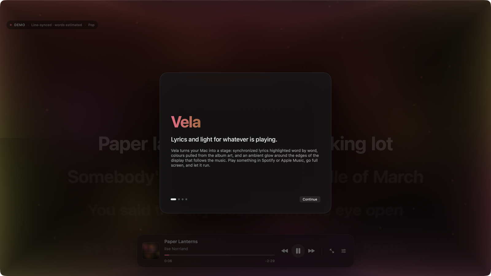

# Vela

Vela is a native macOS app that turns whatever is playing in Spotify or Apple Music into a
full-screen stage: synchronized lyrics highlighted word by word, colours pulled from the album
artwork, and an ambient light around all four edges of the display that follows the music.
Every song gets a visual personality of its own: rap hits hard and dark, electronic pulses in
neon, ambient drifts like liquid, acoustic stays hushed and spacious.

It is a normal foreground application, not a screensaver or lock-screen tweak. Open the window,
press ⌘F, and let it run.

<p align="center">
  
</p>

## Download

Grab the latest disk image from the [Releases](../../releases) page, open it and drag Vela to
Applications. The build is signed for local use only (no Apple Developer ID yet), so the first
launch needs a right-click › Open, or:

```bash
xattr -dr com.apple.quarantine /Applications/Vela.app
```

## Six visual profiles

Vela listens to the music and picks a profile automatically, or you lock one in Settings.
Every profile keeps the album artwork as its colour source and bends it: contrast, warmth,
bloom, motion, particles and the way lyrics move all change.

<table>
  <tr>
    <td align="center"><br><b>Rap / Trap</b><br><sub>bass-driven punches, dark backdrop, focused accents</sub></td>
    <td align="center"><br><b>Rock / Metal</b><br><sub>warm, high-contrast, drum-hit streaks</sub></td>
  </tr>
  <tr>
    <td align="center"><br><b>Electronic / Dance</b><br><sub>beat-locked pulses, orbiting colour, travelling edge light</sub></td>
    <td align="center"><br><b>Pop</b><br><sub>glossy blooms, balanced motion</sub></td>
  </tr>
  <tr>
    <td align="center"><br><b>R&amp;B / Ambient</b><br><sub>liquid gradients, slow waves, floating lyrics</sub></td>
    <td align="center"><br><b>Acoustic / Classical</b><br><sub>soft luminance, minimal light, phrase-driven motion</sub></td>
  </tr>
</table>

<p align="center">
  
  
</p>

## Highlights

- **Word-by-word lyrics** from LRCLIB, imported `.lrc` files or the bundled demo songs, with
  honest timing: word-synced, line-synced (words estimated) or plain.
- **Album-art palette** extracted per track and corrected for readability, then styled by the
  active profile.
- **Audio-reactive background and edge light** rendered in Metal: bass expands the artwork and
  thickens the glow, mids move the gradient, highs add fine detail, onsets and beats fire short
  smoothed impulses. Never flashing, never strobing.
- **Hybrid Auto detection**: genre metadata when the player exposes it, otherwise a deterministic
  heuristic over tempo, spectral balance, onsets, dynamics and rhythmic regularity, with
  hysteresis so the profile stays stable for the track.
- **Demo Mode** with eight original songs and one audio fixture per profile, so everything can
  be tried without a player, permissions or network.
- **Accessibility**: Reduce Motion, Increase Contrast, Reduce Transparency, VoiceOver labels and
  full keyboard control.

## Requirements

- macOS 14 Sonoma or later, Apple Silicon.
- Xcode 16 or later (the project uses Xcode's synchronized folder groups). Built and tested with Xcode 26.
- Spotify and/or Apple Music for real playback. Neither is required for Demo Mode.

## Build from source

```bash
open Vela.xcodeproj
```

Select the **Vela** scheme and press Run, or from the terminal:

```bash
xcodebuild -project Vela.xcodeproj -scheme Vela -configuration Debug build
```

```bash
xcodebuild -project Vela.xcodeproj -scheme Vela -configuration Debug test
```

The project signs ad hoc ("Sign to Run Locally"). Set your team in the target's Signing settings
if you want macOS to remember the privacy permissions across rebuilds; with ad-hoc signing, TCC
treats every new build as a new app and asks again.

The edge-glow shader is compiled at runtime from source (`EdgeGlowShaderSource.swift`), so the
Metal shader toolchain does not need to be installed to build the project.

## Using Vela

| Action | How |
| --- | --- |
| Full screen | ⌘F (or the button in the controls bar) |
| Reveal controls | Move the pointer, or press Space |
| Play / pause | Space while controls are visible |
| Seek ±5 s | ← / → (when the source supports seeking) |
| Previous / next track | ⌘← / ⌘→ |
| Settings | ⌘, |
| Demo Mode | ⌘⇧D |
| Close settings, then leave full screen | Esc |

The controls bar hides after about three seconds of inactivity while music is playing.

### Visual profiles

Different music gets a different visual personality. Settings › Visual profile offers **Auto**
(default) and six lockable profiles: Rap / Trap, Rock / Metal, Electronic / Dance, Pop,
R&B / Ambient and Acoustic / Classical. A manual choice always wins until you return to Auto, and
the choice persists across launches. Four sliders scale reactivity overall, the background, the
edge light and lyric motion; particles and "reduce intense motion" are toggles. "Preview profile"
plays a ten-second deterministic simulation of any profile over the current scene without
touching playback, and the Analysis disclosure shows what the detector currently measures.

Auto is hybrid. When the player exposes a genre (Apple Music does, Spotify's scripting interface
does not) the genre string is normalised onto a profile immediately. Otherwise the system-audio
features drive a deterministic heuristic (see Architecture). Detection waits for an initial
window, locks once confident, keeps the profile for the track, and only re-evaluates when the
initial confidence was low or the music changes substantially and persistently. Profiles
crossfade rather than switch; Pop is the neutral fallback.

Three lyric styles are available in Settings: **Focus** (default; centred line, precise word
highlighting), **Drift** (neighbouring lines recede through depth) and **Bloom** (words swell and
glow as they are sung). Settings also cover palette (automatic from artwork or manual), lyric size,
glow thickness / intensity / spread, music-reactive motion, reduced effects, lyric timing offset
(−5 s … +5 s), preferred music source, full-screen display and launch at login. Settings persist
between launches.

## Permissions and why

Vela asks for two things, both explained during onboarding and both optional:

1. **Automation (Apple Events) for Spotify and Music.** Vela reads the current track, position,
   state and artwork and sends play/pause/skip/seek through each app's public AppleScript
   dictionary. macOS shows a one-time prompt per app the first time Vela talks to it. Vela never
   launches a player on its own; it only talks to players that are already running.
2. **Screen & System Audio Recording.** The ambient light reacts to bass and loudness by analysing
   the audio your Mac is playing, captured with ScreenCaptureKit (`capturesAudio` only; a 2×2 px
   video stream is configured because the API needs a display filter, and its frames are
   discarded). The microphone is never captured. Samples are analysed locally with Accelerate
   and never stored. Without this permission the light breathes on its own.

Denying either permission leaves the app fully usable. Permission state is shown in Settings with
shortcuts to the relevant System Settings panes.

## Architecture

Everything lives in one app target, grouped by responsibility:

- `App/AppModel.swift` — `@MainActor @Observable` application state. Consumes player events,
  drives lyric/artwork loading with cancellation, owns overlay/keyboard/fullscreen state.
- `MusicSources/` — `MusicSource` protocol, `SpotifySource` and `AppleMusicSource` (AppleScript on
  a private serial queue, never the main thread), `DemoMusicSource` (actor with a real-time
  timeline), and `MusicSourceCoordinator` (an actor that detects the active player, polls at an
  adaptive rate, listens to the players' distributed notifications, and forwards commands).
- `Lyrics/` — `LyricsProvider` protocol; `LRCParser` (standard and enhanced word-level LRC),
  `WordTimingEstimator`, `LyricTimeline` (cursor-based active-word lookup with binary-search
  seeking), `LRCLIBProvider`, `LyricsCache` (disk, keyed by a normalised hash of artist/title/
  album/duration), `LocalLyricsStore` (imported `.lrc` files) and `LyricsService` (the resolver).
- `Palette/` — `PaletteExtractor` (histogram over a 32×32 sample), `PaletteCorrector` (contrast,
  similarity and muddiness rules), `ArtworkProcessor` (soft and sharp pre-blurred backdrops).
- `Audio/` — `SystemAudioCapture` (ScreenCaptureKit), `SpectrumAnalyzer` (vDSP FFT → raw band
  energies, RMS, spectral centroid and flux per block), `FeatureExtractor` (normalisation,
  per-band transients, onset detection, autocorrelation tempo estimate with beat-phase tracking,
  onset density, transient strength, dynamic range, loudness, regularity), `ProfileFixtures`
  (deterministic per-profile "music" for Demo Mode and previews, run through the same
  extractor), and `FeatureStore` (lock-protected mailbox to the render thread).
- `Visual/` — `VisualProfile` / `VisualProfilePreset` (declarative per-profile parameters with
  interpolation, Reduce Motion and intensity transforms), `GenreNormalizer`,
  `ProfileClassifier` (weighted range-membership scoring), `ProfileDetector` (windowing,
  locking, hysteresis), `PaletteStyler` (profile colour treatment with readability re-enforced)
  and `VisualDirector`, which fuses profile, features, palette, accessibility and user
  intensities into one attack/release-smoothed `ReactiveVisualState` per frame.
- `Rendering/` — `SceneRenderer` (Metal: artwork backdrop with bass expansion and restrained
  warp, six palette control points that orbit/flow/compress, beat rings, hi-hat slices, drum
  streaks, vignette, grain, the SDF edge light with travelling head, plus an instanced particle
  pass capped at 160 sprites; paused when occluded or minimised) and a SwiftUI `Canvas`
  fallback for machines without Metal.
- `Scene/` — the SwiftUI stage: `LyricsStageView` samples the playback clock each frame,
  `LyricLineStack` positions lines with spring motion, `LyricLineView`/`LyricWordView` render
  words with progressive fill and bloom, plus overlays, onboarding, settings and status states.
- `Settings/` — typed `VelaSettings` persisted by `SettingsStore`.
- `Window/WindowController.swift` — AppKit bridge for fullscreen, display selection and notch
  geometry.

### Profile classification heuristic

`ProfileClassifier` scores each profile as the weighted mean of range memberships over eleven
features (BPM with octave alternatives, BPM confidence, bass-to-mid ratio, high energy, spectral
centroid, spectral flux, onset density, transient strength, dynamic range, loudness, rhythmic
regularity). A feature scores 1 inside the profile's range and falls off linearly outside it.
Confidence is the best score weighted by its margin over the runner-up. `ProfileDetector` smooths
the score vector with an exponential average, waits for eight seconds and twelve samples, locks
when confidence is at least 0.5 (otherwise Pop), re-evaluates every twenty seconds only if the
initial confidence was below 0.72, and otherwise switches only after a ten-second, very
confident contradiction. Genre metadata short-circuits all of this.

Timing is honest end to end: a `LyricDocument` carries a `TimingQuality` (word-synced,
line-synced, estimated, unsynced) and every `TimedWord` records whether its timestamps were
estimated. LRCLIB returns line-level timing, so its words are estimated by length and punctuation;
enhanced LRC files (`<mm:ss.xx>` tags) are used verbatim. Plain lyrics fall back to a slowly
scrolling unsynced mode.

## Development hooks

A few environment variables make the app scriptable for checks and screenshots:

| Variable | Effect |
| --- | --- |
| `VELA_DEMO_TRACK=<id>` | Launch straight into a demo fixture (ids in `DemoCatalog.swift`) |
| `VELA_ALWAYS_RENDER=1` | Keep the Metal scene rendering while the window is occluded |
| `VELA_SCREENSHOT_PATH=/path.png` | Save the window to disk after `VELA_SCREENSHOT_DELAY` seconds |
| `VELA_WINDOW_SIZE=1600x900` | Size the window before a capture |
| `VELA_SCREENSHOT_SETTINGS=1`, `VELA_SCREENSHOT_ONBOARDING=1` | Show those layers in the capture |

The README images were produced this way from Demo Mode.

## Real-integration limitations

- Spotify's AppleScript dictionary reports artwork as a URL, so Spotify artwork needs network
  access. Apple Music artwork comes straight from the app.
- Only Spotify and Apple Music are supported; there is no public API for "whatever is playing
  system-wide". Other players show the "Nothing playing" state.
- LRCLIB is a community database. Coverage is good but not universal; lyrics are line-synced,
  never word-synced. The provider boundary (`LyricsProvider`) is ready for a word-level provider
  should one be added; no keys or paid services are used.
- With ad-hoc signing, macOS re-asks for permissions after each rebuild (see above).
- macOS may require the app to be relaunched after Screen Recording permission is first granted.

## Demo Mode

Demo Mode (⌘⇧D, or "Try Demo" at the end of onboarding) needs no players, permissions or
network. `DemoMusicSource` simulates an eight-track catalogue with a real-time timeline, seeking,
skipping and pausing. Artwork is drawn procedurally per track and lyrics are original texts
bundled as `.lrc`/`.txt` files. Six tracks are audio fixtures, one per visual profile (Concrete
Halo → Rap / Trap, Wirecutter → Rock / Metal, Signal Bloom → Electronic / Dance, Paper Lanterns →
Pop, Low Tide Signal → R&B / Ambient, Kitchen Light → Acoustic / Classical); the remaining two
show the unsynced and instrumental states. Fixtures generate deterministic kick/snare/hat
patterns, section dynamics and spectral character that run through the real `FeatureExtractor`,
so Auto detection, the diagnostics and the reactive background behave exactly as with captured
audio. Settings › Demo Mode picks a track directly; ⌘⇧N cycles the fixtures.

All demo lyrics and artwork were created for this project.
